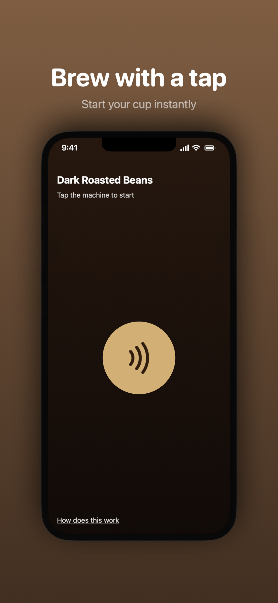
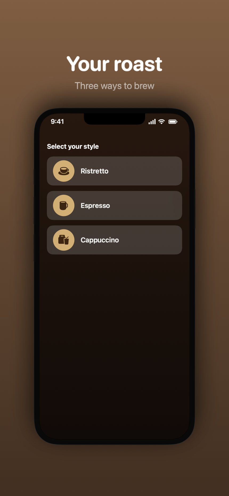
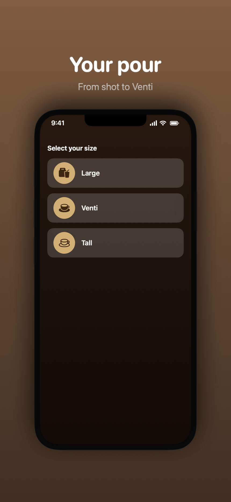
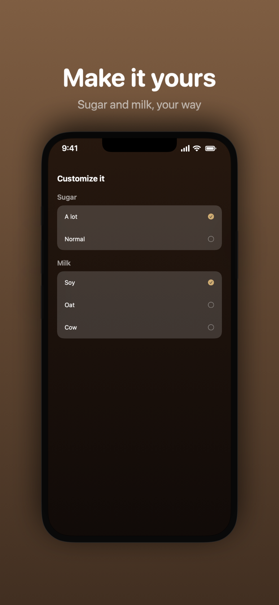

# CafeApp example

| Home | Styles | Size | Extras |
| --- | --- | --- | --- |
|  |  |  |  |

Four `ScreenshotScene`s modeled on real screens from
[CafeApp](https://github.com/Arashk-A/CafeApp), a SwiftUI coffee-ordering app,
in the order the app navigates them: the Home "tap to start" screen, the
coffee-style picker (`CoffeesView`), the size picker (`CoffeeSizeView`), and the
extras picker (`ExtrasView`).

CafeApp's real screens use `RealmSwift` models and custom cup artwork. To keep
this example dependency-free, `CafeMockData.swift` copies the app's own
`CoffeesMock.json` fixture verbatim and decodes it into plain `Decodable`
structs (no Realm), and `CafeViews.swift` re-implements the screens' layout with
that real sample data and SF Symbols in place of the custom images.

Each screen is rendered as a **full iPhone** using `DeviceFrame` (notch + status
bar) inside a `ShotCard` with a marketing caption above it and a custom warm
mocha `background`, so the shots read like real phone screenshots:

```swift
ShotCard("Your roast", subtitle: "Three ways to brew", accent: .orange,
         framed: false, background: { cafeMarketingBackground }) {
    DeviceFrame { CafeScreen { StyleScreen() } }
}
```

## Files

- `CafeMockData.swift` — CafeApp's real `CoffeesMock.json` fixture, decoded into
  plain structs (`CoffeeMock`, `CoffeeTypeMock`, `SizeMock`, ...).
- `CafeViews.swift` — the standalone SwiftUI screens (`HomeScreen`,
  `StyleScreen`, `SizeScreen`, `ExtrasScreen`) plus the `CafeScreen` full-screen
  wrapper and the mocha backdrop, populated from that data.
- `CafeScenes.swift` — the `ScreenshotScene` wrappers (`HomeScene`, `StyleScene`,
  `SizeScene`, `ExtrasScene`) that put each screen in a `DeviceFrame` + `ShotCard`,
  at iPhone App Store size, in navigation order.

## Try it

Regenerate the screenshots above with the `CafeExportTool` executable target:

```sh
swift run CafeExportTool Examples/CafeApp/Screenshots
```

These example targets aren't part of the `ShotKit` library product, so they
never ship to an app that depends on ShotKit — they only build when you build
this repo. Keep captions short: `ShotCard`'s auto-fit only checks vertical
space, so very long text can overflow the narrower iPhone canvas width.
