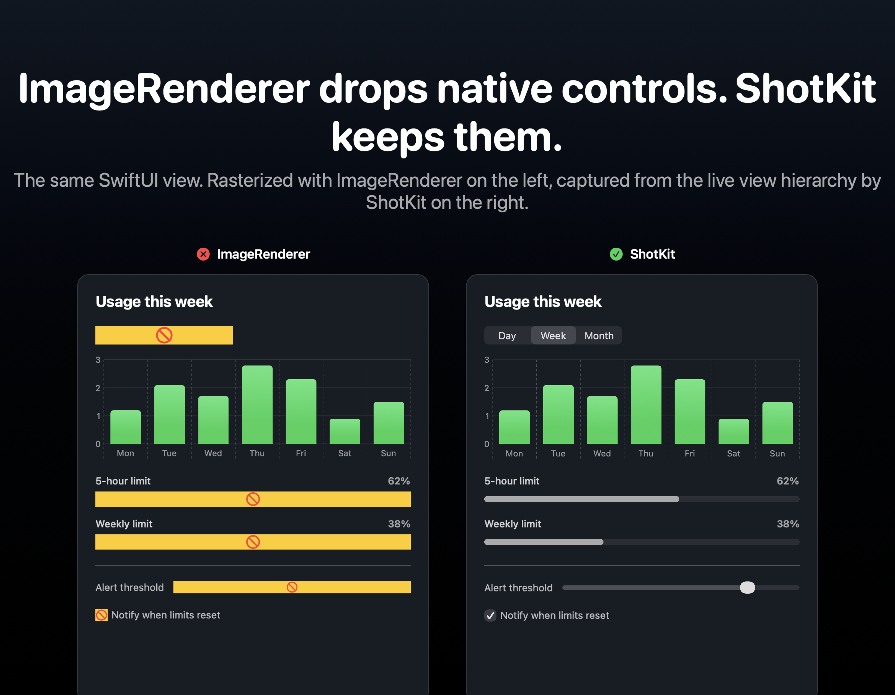
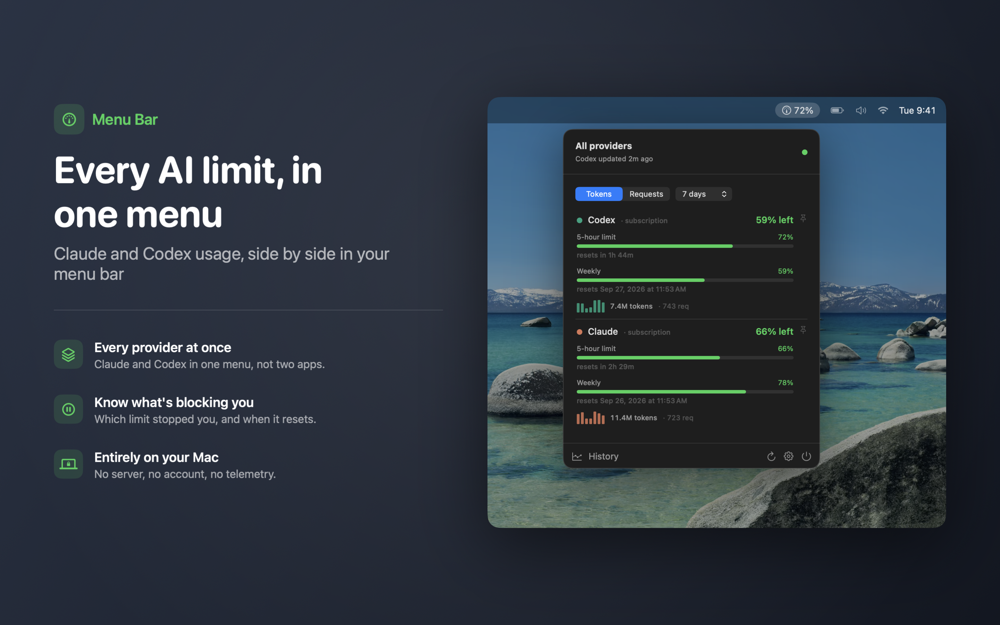
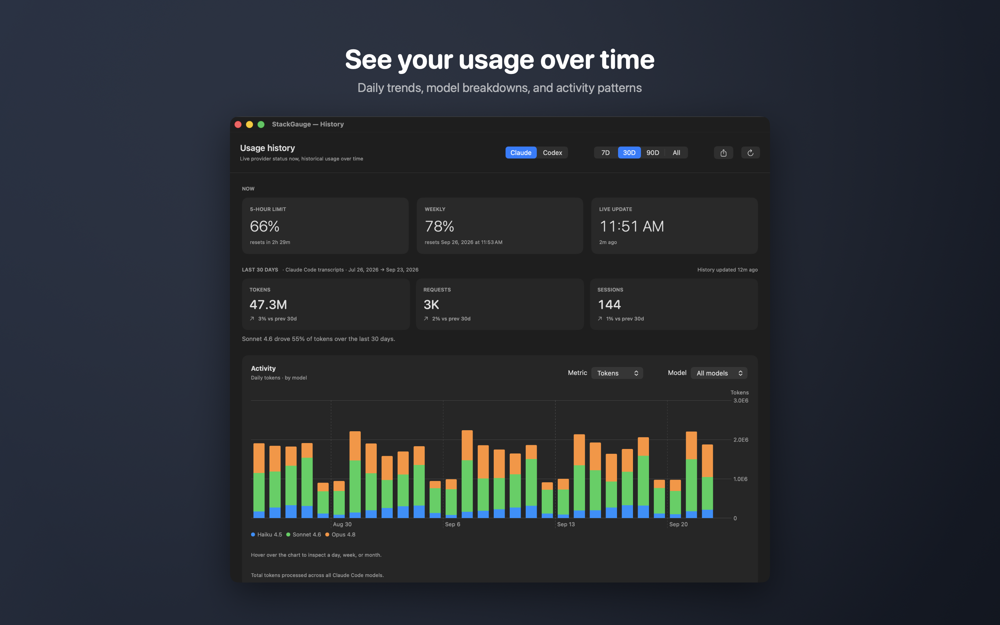
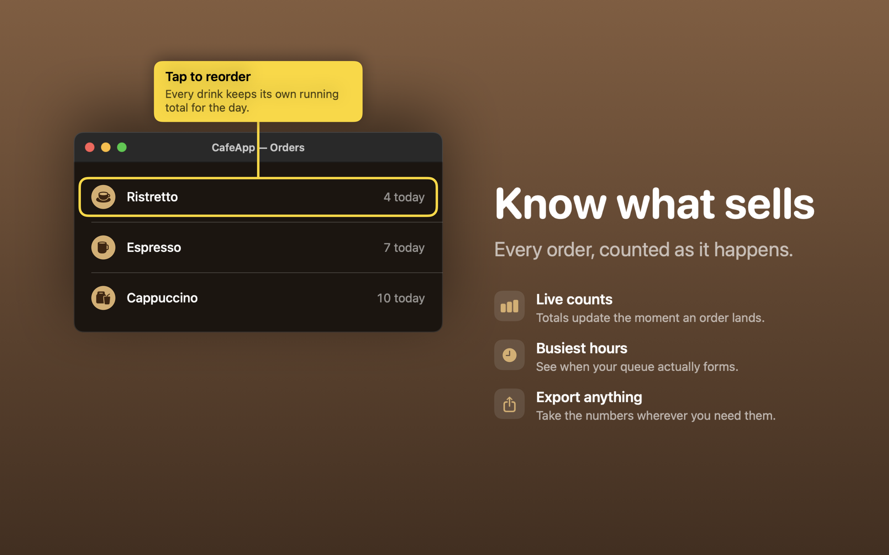
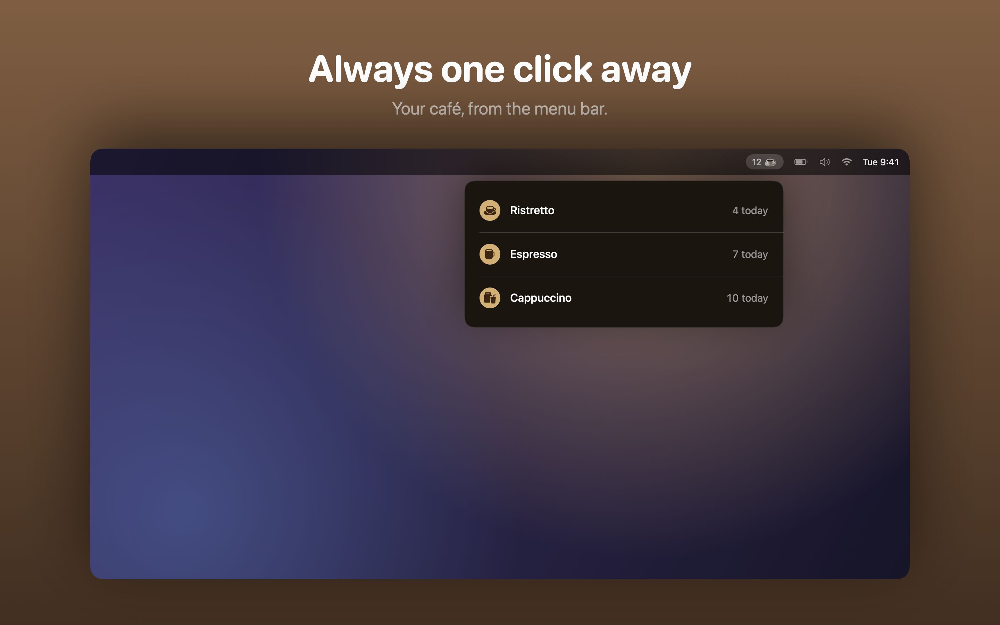
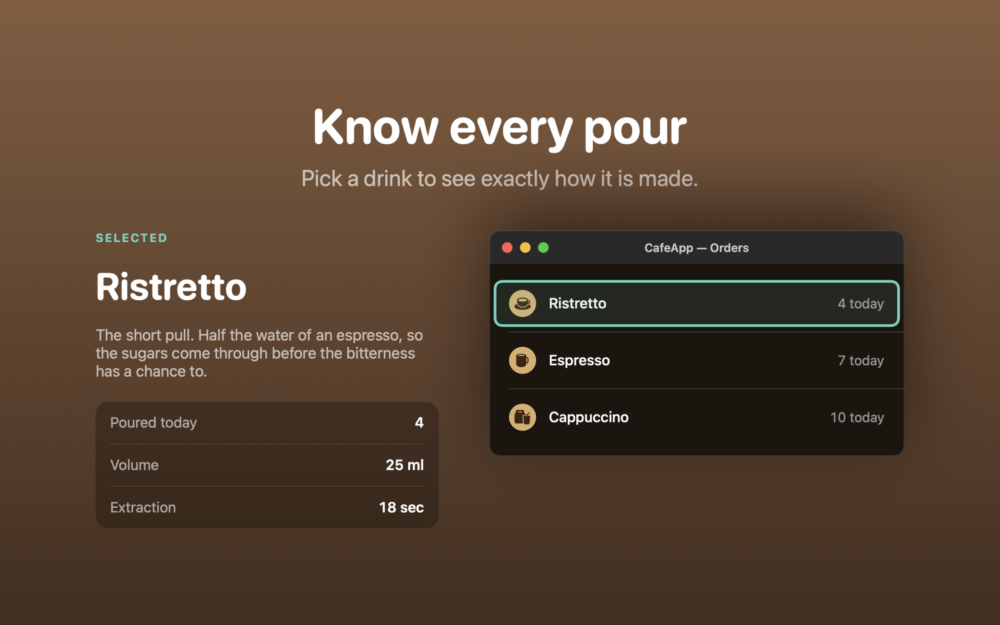

# ShotKit

[](https://github.com/birangdev/ShotKit/actions/workflows/ci.yml)
[](https://swiftpackageindex.com/birangdev/ShotKit)
[](https://swiftpackageindex.com/birangdev/ShotKit)
[](LICENSE)

A tiny, project-agnostic App Store screenshot engine for SwiftUI apps on macOS
and iOS.

ShotKit renders your real views into marketing screenshots at exact App Store
pixel sizes. It captures the **live view hierarchy** from a real window, so
native controls that `ImageRenderer` replaces with a placeholder (segmented
`Picker`s, linear `ProgressView`s, `Slider`s, `Toggle`s, and more) come out
looking exactly like the running app.



## Why not `ImageRenderer`?

`ImageRenderer` rasterizes SwiftUI's own drawing, but AppKit- and UIKit-backed
controls aren't part of that drawing. A segmented picker, a linear progress bar,
a slider, or a toggle each comes out as a "no-entry" placeholder, and a
`ScrollView`'s content below the fold can be missing. ShotKit instead hosts the
view in a real window and snapshots the live hierarchy (`cacheDisplay` on macOS,
`drawHierarchy` on iOS), so what you capture is what the user sees, at the
screen's backing scale (2x on Retina gives a 2880x1800 image from a 1440x900
canvas).

The image above is `Examples/CafeApp`'s `ControlsPanel`, captured both ways.
Regenerate it with `swift run ComparisonTool Examples/CafeApp/Screenshots`.

## Features

- **True-to-app capture** of real controls and charts, not just SwiftUI drawing.
- **Auto-fit composition.** `ShotCard` wraps your view in an optional headline +
  marketing card and scales the whole thing to fit the canvas, so a
  compact popover stays large while a tall settings/scroll window shrinks just
  enough to be captured whole. Nothing clips, with no per-screenshot tuning.
- **Optional captions.** Pass `title: nil` to `ShotCard` to capture the framed
  shot without any headline/subtitle text, just the view.
- **Caption on any edge.** `placement:` puts the headline above, below, or
  beside the content. A side placement leaves room for a feature list via the
  `detail:` slot, which is the usual two-column marketing layout.
- **macOS window chrome.** `WindowChrome` adds a title bar and traffic lights,
  so a captured Settings or History window reads as a window.
- **Menu-bar framing.** `MenuBarFrame` hangs a popover from a menu bar with the
  app's own status item highlighted, which is the only way a menu-bar app's UI
  reads as a menu-bar app rather than a floating panel.
- **Highlights.** `.shotHighlight("Note")` rings one control and annotates it
  without moving anything around it.
- **Callouts.** `.shotCalloutTarget("id")` plus `.shotCallouts([...])` explains a
  control too small or too hemmed-in to carry a note beside it, drawing the note
  outside the clipping container with a leader line back to the control.
- **iPhone device frames.** Wrap iOS screens in `DeviceFrame` for a real notch,
  status bar, and bezel, so shots read as phone screenshots, not flat images.
- **Customizable background.** `ShotCard` defaults to a dark gradient, but
  takes any `View` as its `background` — a brand color, a different gradient,
  an image — set per scene.
- **Exact App Store sizes** via `ScreenshotSpec` / `AppStoreSize` (macOS and iOS
  presets).
- **Batch export** to a folder as `<name>.png`.

## Requirements

- macOS 13+ or iOS 16+
- A live UI session. Capture uses a real (briefly on-screen) window, so ShotKit
  needs a window server / active window scene — run it from your app, or from a
  small executable that brings up `NSApplication` (see the example's
  `CafeExportTool`). A plain script with no app context won't render.

### What runs where

Composition and annotation are pure SwiftUI and behave identically on both
platforms. Only the window-level capture is macOS-specific.

| | macOS | iOS |
|---|---|---|
| `ShotCard`, captions, `ScaledContent`, `ShotBackground` | yes | yes |
| `.shotHighlight` and callouts (`.shotCalloutTarget` / `.shotCallouts`) | yes | yes |
| `DeviceFrame` (iPhone mockup) | yes | yes |
| `WindowChrome`, `MenuBarFrame`, `DesktopFrame` | yes | compiles, but they draw macOS furniture |
| `ShotKit.capturePNG` / `export` | `cacheDisplay` | `drawHierarchy` |
| `CaptureMethod.windowServer` | composites materials | accepted and ignored |
| `ShotKit.captureWindow`, `WindowSnapshot` | yes | not available |

The annotation APIs are covered by tests that run on both platforms
(`AnnotationRenderingTests`), so an iOS regression fails CI rather than turning
up in someone's screenshots.

## Installation

Swift Package Manager. Add it to your `Package.swift`:

```swift
dependencies: [
    .package(url: "https://github.com/birangdev/ShotKit.git", from: "1.1.0")
]
```

and add `"ShotKit"` to your target's `dependencies`. In Xcode:
**File > Add Package Dependencies…** and enter
`https://github.com/birangdev/ShotKit.git`.

The product is built as a static library, so if your only call sites are
compiled out (for example behind `#if DEBUG`), the linker drops ShotKit from
your Release binary.

## Usage

Describe each screenshot as a `ScreenshotScene`: give it a `spec` (name + size)
and a `makeContent()` that returns the view to capture. `ShotCard` gives you a
ready-made marketing layout, but you can return any view.

```swift
import ShotKit
import SwiftUI

struct MenuScene: ScreenshotScene {
    var spec: ScreenshotSpec { ScreenshotSpec("01-overview") }

    @MainActor
    func makeContent() -> AnyView {
        AnyView(
            ShotCard(
                "Your limits, at a glance",
                subtitle: "Live usage, right in your menu bar",
                accent: .green
            ) {
                // Your real view, at its natural size.
                MenuBarView(model: .demo)
                    .fixedSize()
                    .background(Color(nsColor: .windowBackgroundColor))
            }
        )
    }
}
```

Then export a batch to a folder:

```swift
@MainActor
func exportScreenshots(to folder: URL) {
    let scenes: [ScreenshotScene] = [MenuScene(), /* ... */]
    let urls = ShotKit.export(scenes, to: folder)
    print("Wrote \(urls.count) screenshots to \(folder.path)")
}
```

`ShotKit.export` creates the folder if needed and writes one PNG per scene named
after its `spec.name`. For a single image, use `ShotKit.capturePNG(_:)` and write
the `Data` yourself.

### Captions on or off

`ShotCard`'s title and subtitle are optional. Omit them to capture just the
framed view (still on the gradient background, still auto-fit) with no text:

```swift
// Marketing shot with a headline:
ShotCard("Your limits, at a glance", subtitle: "Right in your menu bar") { view }

// Same framed shot, no caption text:
ShotCard { view }
```

Thread a flag through your scenes to switch between the two for a whole batch.

### macOS windows

On macOS you usually capture a real app window or menu-bar popover directly — no
device frame needed. The default `ShotCard` gives the content a rounded "window"
look with a border and shadow, and its auto-fit scales it to the canvas:

```swift
ShotCard("Everything at a glance", subtitle: "Right in your menu bar") {
    MenuBarView(model: .demo)          // your real SwiftUI view
        .fixedSize()                   // natural window size
        .background(Color(nsColor: .windowBackgroundColor))
}
```

Keep `framed: true` (the default) on macOS. `DeviceFrame` is for iOS screens (see
below); you don't use it for Mac windows.

### iPhone device frames

For iOS screenshots, wrap the screen in `DeviceFrame` so it reads as a real
phone, and pass `framed: false` to `ShotCard` so it doesn't add a Mac-window
border around the device:

```swift
ShotCard("Order in seconds", subtitle: "Your usual, one tap away", framed: false) {
    DeviceFrame {
        MyScreen().frame(width: 393, height: 852)
    }
}
```

`DeviceFrame` draws the bezel, a notch (or `.dynamicIsland`), a status bar, and
side buttons from pure SwiftUI shapes. Size the screen content yourself; content
taller than the device is clipped to what fits. Options:

```swift
DeviceFrame(
    cutout: .notch,            // .dynamicIsland / .none
    showsStatusBar: true,
    statusBarTime: "9:41",
    lightStatusBar: true,      // white glyphs for dark content, false for light
    showsSideButtons: true
) { screen }
```

### Caption beside the content

For a two-column layout, move the caption to a side and use `detail:` for
supporting points. Side placements are fitted horizontally as well as
vertically, since the caption and content compete for width:

```swift
ShotCard(
    "Know what sells",
    subtitle: "Every order, counted as it happens.",
    framed: false,
    placement: .trailing,
    detail: { FeatureList(features) }
) {
    WindowChrome(title: "CafeApp — Orders") { OrdersView() }
}
```

### Framing a menu-bar app

A popover captured on its own is just a rounded rectangle. `MenuBarFrame`
supplies the context, measuring the status item so the popover hangs beneath
it rather than from the bar's corner:

```swift
ShotCard("Always one click away", framed: false) {
    MenuBarFrame(statusText: "78%") {
        MenuBarView(model: .demo)
    }
}
```

### Pointing at one control

```swift
SettingsRow()
    .shotHighlight("Switch providers here", edge: .trailing)
```

The ring and note are overlays, so nothing shifts. Inside a container that
clips — a window frame, a scroll view — pass `style: .withinBounds` so both the
ring and the note stay within the highlighted view's bounds. Without it, a
control that reaches its container's edge gets a ring sliced off by the frame,
which reads as a rendering fault rather than as an annotation.

### Explaining a control that has no room

A ring plus a note works when the control has slack around it. A 30pt icon in a
narrow popover has none, and a clipping container cuts off anything that
reaches past its bounds. A **callout** splits the two apart: mark the control
inside the container, and draw the ring, leader line, and note from outside it.

```swift
ShotCard("Pin what matters") {
    MenuPopover {
        PinButton()
            .shotCalloutTarget("pin")      // marks it; draws nothing
    }
    .clipShape(RoundedRectangle(cornerRadius: 14))
    .shotCallouts([                        // outside the clip
        ShotCallout(
            "pin",
            "Pin a provider",
            detail: "Keeps it in the menu bar, whatever else is running low.",
            side: .bottom,
            shape: .circle
        )
    ])
}
```

Ordering matters twice over. Put `.shotCallouts` **outside** the clip, or the
note is clipped along with everything else. Keep it **inside** `ShotCard`'s
content, though: the card auto-scales what it is given, and a callout applied
over the finished card resolves its anchors in the unscaled layout, so the ring
lands away from the control it is meant to be ringing.

`side` picks which way the leader line runs. For `.top` and `.bottom` the note
is centred on the control and then kept within the container's width, so a
control near an edge does not push its note off the canvas.

### Custom background

`ShotCard` defaults to a dark gradient, but takes any `View` as its
`background` — set it per scene to brand a batch differently, or to match a
scene's accent:

```swift
ShotCard("Fuel up", subtitle: "Track every cup", background: {
    LinearGradient(colors: [.brown, .black], startPoint: .top, endPoint: .bottom)
}) {
    view
}
```

Pass a plain `Color`, an `Image`, or any composed view — it fills the whole
canvas behind the caption and framed content, same as the default gradient.

### Native macOS windows and NavigationSplitView

**macOS only.** For a split view that needs the app's native sidebar, toolbar,
title bar, and materials, capture the window **before** composing the marketing
card. The async native-window API needs macOS 14 or later.

It never prompts, and by default it never fails for want of a permission.
`NativeWindowCaptureMethod.automatic` uses ScreenCaptureKit when Screen
Recording is already granted and falls back to the WindowServer otherwise —
a process capturing its *own* windows needs no grant at all, which is what keeps
unsigned development builds and CI working. Pass `.screenCaptureKit` to demand
the modern API and get an error instead of the fallback, or `.windowServer` to
skip it entirely. Both paths return the same bitmap.

The closest match to your app is its existing visible window:

```swift
// On the main actor, after the app's view/data is ready:
let snapshot = try await ShotKit.captureWindow(settingsWindow, scale: 2)
```

Alternatively, host your view in a temporary native window:

```swift
let snapshot = try await ShotKit.captureWindow(
    configuration: NativeWindowConfiguration(
        title: "My App — Settings",
        contentSize: CGSize(width: 800, height: 520),
        scale: 2,
        appearance: NSAppearance(named: .darkAqua)
    ),
    configure: { window in
        window.toolbarStyle = .unified
        // Match any other window configuration your app needs here.
    },
    prepare: { window in
        // Await app-specific fixture loading here, if needed.
    }
) {
    SettingsView(model: .demo)
}

// Use this inside your ScreenshotScene.makeContent():
ShotCard("Your headline", framed: false) {
    snapshot
}

// Or save the native window alone:
let png = try snapshot.pngData()
```

`contentSize` is the viewport size in points, excluding the native title bar.
Scrolling content stays clipped to that viewport. The title bar is included in
`snapshot.pointSize` and the PNG; the outside window shadow is excluded. The
requested `scale` controls output pixels per point independently of screen scale.
The snapshot is a fixed-size bitmap view, so `ShotCard` can scale it without
changing the split view's column layout. Do not wrap it in `WindowChrome`, which
draws a decorative frame, or add a second frame with `ShotCard(framed: true)`.

Capturing an existing window preserves its configuration and does not activate
or close it. The temporary-window overload briefly activates the app and makes
its window key, then closes it and restores the prior visible key window even
if preparation or capture fails. Run captures sequentially. Scene-level window
customization is not inferred from a view: use the existing-window overload when
your app relies on it. Neither overload captures below a scroll view's viewport.

A standalone fixture exports native windows and marketing cards at two viewport
sizes, plus legacy cards for comparison. Each run creates a new subfolder and
does not overwrite existing images:

```sh
swift run NativeWindowExportTool /path/to/output --request-screen-recording
```

Only the sample tool's explicit `--request-screen-recording` flag requests OS
permission. The test suite needs none: it verifies captured pixels and
resolution through the WindowServer path, and additionally exercises
ScreenCaptureKit when the grant happens to be present.

### Tips for the captured view

- Return the view at its **natural size** (`.fixedSize()`), or pin only the axis
  you want fixed. `ShotCard` scales the result to fit, so a `ScrollView` or
  grouped `Form` given `.fixedSize(vertical: true)` expands to its full content
  height and gets captured whole rather than clipped to a scrolling viewport.
- Drive the view from a demo/fixture model so it renders a known state and does
  not depend on live data. Because capture runs a real run loop, the view's
  `onAppear` will fire, so make sure your model does not overwrite the fixture.

### Headless export (optional)

Because capture needs a window server, trigger it from inside your app. A common
pattern is an environment-variable hook that exports and quits, so screenshots
can be regenerated from the command line:

```swift
// In your AppDelegate / applicationDidFinishLaunching:
if ProcessInfo.processInfo.environment["EXPORT_SHOTS"] != nil {
    let folder = /* a folder your app can write to */
    ShotKit.export(allScenes, to: folder)
    NSApp.terminate(nil)
}
```

```sh
EXPORT_SHOTS=1 path/to/YourApp.app/Contents/MacOS/YourApp
```

## Used in production

ShotKit was pulled out of
[StackGauge](https://apps.apple.com/us/app/stackgauge/id6805932465), a macOS
menu-bar app, after `ImageRenderer` kept dropping the gauge, toggles, and charts
from its App Store screenshots. Every image on the StackGauge listing is a
ShotKit capture of the real app views driven by fixture data. Two of them:

| Menu popover | History window |
| --- | --- |
|  |  |

The segmented controls, the pop-up buttons, the progress bars and the chart are
exactly what a rendered screenshot loses. The left shot also uses `MenuBarFrame`
inside `DesktopFrame` with a `.leading` caption; the right one is
`ShotKit.captureWindow`, so the title bar is the app's own rather than drawn.

## Example

`Examples/CafeApp` is a self-contained example that captures four screens of
[CafeApp](https://github.com/Arashk-A/CafeApp), a coffee-ordering app, in the
order the app navigates them: Home → coffee styles → size → extras. It stands in for the
app's RealmSwift models and custom artwork with fixture data (`CoffeesMock.json`)
and SF Symbols, so it builds on its own with no third-party dependencies. It's
the file to copy from to see how to drive ShotKit: each screen is a full iPhone
`DeviceFrame` inside a `ShotCard`, over a custom mocha `background`.

| Home | Styles | Size | Extras |
| --- | --- | --- | --- |
|  |  |  |  |

The same module also builds the desktop compositions, so each one is a working
reference rather than a description:

| Callout | Menu bar on a desktop | Highlight + detail |
| --- | --- | --- |
|  |  |  |

`05` pairs `.shotCalloutTarget` with `.shotCallouts` outside `WindowChrome`'s
clip, `06` puts `MenuBarFrame` inside `DesktopFrame`, and `07` rings a row with
`.shotHighlight` and explains it from a panel beside the window, tied together
by a shared accent.

Regenerate the screenshots:

```sh
swift run CafeExportTool Examples/CafeApp/Screenshots
```

`swift run ComparisonTool Examples/CafeApp/Screenshots` regenerates the
`ImageRenderer` vs ShotKit image near the top of this README from the same
example module.

The example targets aren't part of the `ShotKit` library product, so they're
never pulled into an app that depends on ShotKit — they only build when you
build this repo. See `Examples/CafeApp/README.md` for details.

## API

| Type | Purpose |
| --- | --- |
| `ScreenshotSpec` | A screenshot's output name, point size, and scale. |
| `AppStoreSize` | Standard canvas sizes. macOS: `.macPoints` (1440x900 @2), `.macPointsAlt` (1280x800 @2). iOS: `.iPhone67` (@3 -> 1290x2796), `.iPhone65` (@3 -> 1242x2688), `.iPad13` (@2 -> 2048x2732). |
| `ScreenshotScene` | Protocol: a `spec` plus `@MainActor func makeContent() -> AnyView`. |
| `ShotKit.capturePNG(_:)` | Captures one scene to PNG `Data`. |
| `ShotKit.export(_:to:)` | Captures many scenes and writes PNGs into a folder. |
| `ShotCard` | Marketing card: customizable background (dark gradient by default), optional headline/subtitle, auto-fit. `framed: false` drops the Mac-window border for content with its own shape. |
| `DeviceFrame` | iPhone mockup (notch or Dynamic Island, status bar, side buttons) wrapping your screen content. Pair with `ShotCard(framed: false)`. |
| `WindowChrome` | macOS window frame: title bar, traffic lights, optional title. Pair with `ShotCard(framed: false)`. |
| `MenuBarFrame` | A menu bar with neighbouring glyphs, a highlighted status item, and the popover hanging beneath it. |
| `CaptionPlacement` | `.top`, `.bottom`, `.leading`, `.trailing` — which edge `ShotCard`'s caption occupies. |
| `.shotHighlight(_:edge:style:)` | Rings a view and adds a note, in an overlay so surrounding layout is untouched. Use `style: .withinBounds` inside a clipping container. |
| `.shotCalloutTarget(_:)` / `.shotCallouts(_:style:)` | Marks a control, then rings it and explains it from outside its clipping container, with a leader line back to it. |
| `ScaledContent` / `ScaledLayout` | Scale a view while reserving its scaled size in layout (used by `ShotCard`; reusable). |

### `ScreenshotSpec`

```swift
ScreenshotSpec("05-history")                                          // 1440x900 @2x (mac)
ScreenshotSpec("wide", pointSize: AppStoreSize.macPointsAlt)          // 1280x800 @2x (mac)
ScreenshotSpec("phone", pointSize: AppStoreSize.iPhone67, scale: 3)   // 1290x2796 (iOS)
```

`pixelSize = pointSize * scale`. Pick a `pointSize` and `scale` whose product is
a size the App Store accepts (for example 1440x900 @2x = 2880x1800).

## How it works

1. `makeContent()` is framed to `spec.pointSize` and hosted in a real window in
   dark appearance (`NSWindow` on macOS, `UIWindow` on iOS).
2. The window is briefly shown so SwiftUI, native controls, and Charts lay out
   and draw, then the hierarchy is snapshotted (`cacheDisplay` on macOS,
   `drawHierarchy` on iOS) at `spec.scale`.
3. `ShotCard` composes the marketing card and uses `ViewThatFits` over a set of
   candidate scales. Each candidate reserves its true scaled size via
   `ScaledLayout`, so the largest one that actually fits is chosen and nothing
   overflows the canvas.

## Roadmap

ShotKit 1.0 covers the workflow it was built for. I'd rather grow it from real
use than guess, so if one of these would help you, open an issue and say how you'd
use it:

- **Localization.** Capture the same scenes across languages in one run.
- **More device frames.** iPad, landscape, older iPhone sizes.
- **More App Store size presets.** Especially the newer iPad requirements.
- **Appearance batches.** Light and dark from a single pass.
- **DocC documentation.**

Contributions are welcome. The example module is a good place to see how the
pieces fit together.

## Credits

ShotKit is an open-source project from [Birang Dev](https://mbirang.com). It was
built for [StackGauge](https://apps.apple.com/us/app/stackgauge/id6805932465) and
generates its App Store screenshots.

## License

MIT — see [LICENSE](LICENSE).
